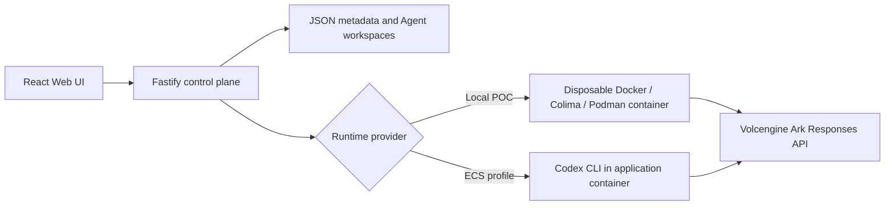

# Volc Agent Launchpad

A minimal Agent platform for three-day middleware hackathons. It provides Agent
CRUD, a browser Playground, persistent workspaces, and Codex CLI backed by the
Volcengine Ark Responses API.

Run it locally with Docker, Colima, or rootless Podman, or deploy it to
Volcengine ECS.

> [!WARNING]
> This is a single-user proof of concept. It intentionally has no identity,
> tracing, audit, or hardened sandbox middleware. Do not use production data or
> credentials. See [SECURITY.md](SECURITY.md).

## Selected track: Kill Switch

This fork adds one piece of middleware: a **sensitive-egress guard** that stops a
running Agent from sending workspace secrets to the network. It runs in the
container Runtime path — not the UI — as deterministic checks over the Agent's
own trace ([`checks.ts`](apps/server/src/checks.ts)). The same function runs
live and offline.

When `GUARDRAIL_ENABLED=true`, a guarded turn runs with network access denied,
so any outbound command escalates to an approval request. A command that carries
a workspace secret — names a secret file, follows a read of one, or carries a
credential's literal bytes — is refused at that approval step before it runs,
with `turn/interrupt` as a backstop. A safe task in the same configuration runs
untouched. See [Guard coverage and limitations](#guard-coverage-and-limitations).

## Screenshots

### Agent Playground


### Create an Agent


## Features

- React and TypeScript Web UI
- Agent create, edit, start, stop, delete, and multi-turn chat
- Fastify control plane with asynchronous Run state
- Persistent Agent workspaces and Codex sessions
- Disposable Docker, Colima, or Podman container for each local turn
- Docker and Terraform deployment paths for Volcengine ECS

## Requirements

- Node.js 22+
- npm 10+
- Docker, Colima, or Podman
- A Volcengine Ark API key and endpoint that supports the Responses API

Codex CLI is included in the Runtime image and is not required on the host.

## Local browser SOP

### 1. Check the local tools

Install Node.js 22+ and one supported container engine, then verify them:

```bash
node --version
npm --version
docker --version        # Docker Desktop, Docker Engine, or Colima
podman --version        # Use this instead when running Podman
```

Only one container engine is required. Codex CLI is already included in the
Runtime image.

### 2. Clone the repository

```bash
git clone <repository-url> volc-agent-launchpad
cd volc-agent-launchpad
```

Skip this step when already working from the repository root.

### 3. Start the POC

```bash
ARK_API_KEY=your-ark-api-key \
ARK_MODEL=ep-your-endpoint-id \
npm run poc
```

The first run installs Node.js dependencies and builds the Runtime image. The
script automatically selects Docker, Colima, or Podman.

### 4. Open the browser

Visit <http://localhost:3000>, or open it from the terminal:

```bash
open http://localhost:3000       # macOS
xdg-open http://localhost:3000   # Linux desktop
```

In the Web UI:

1. Select **Create Agent**.
2. Enter a name, description, and workspace instructions.
3. Select **Create Agent** again.
4. Enter a task in the Playground, for example:

   ```text
   Create a TypeScript hello-world CLI, add a test, and run it.
   ```

The Agent can write files, run commands, and continue the same Codex session in
later messages.

### 5. Stop and resume

Press `Ctrl+C` in the startup terminal. The script removes temporary Runtime
containers but keeps Agent workspaces and conversations.

- macOS state: `~/.volc-agent-launchpad/`
- Linux state: `.local/`
- Custom location: set `LOCAL_POC_DATA_ROOT`

Run the same `npm run poc` command to continue later.

### Select a specific container engine

Force Podman when multiple engines are installed:

```bash
CONTAINER_ENGINE=podman \
ARK_API_KEY=your-ark-api-key \
ARK_MODEL=ep-your-endpoint-id \
npm run poc
```

Colima uses `CONTAINER_ENGINE=docker` because it exposes the Docker CLI.

For a clean Linux host, follow the
[rootless Podman setup](docs/LOCAL_POC.md#rootless-podman-on-linux).

## Docker Compose

Create and edit the configuration:

```bash
./scripts/bootstrap-local.sh
```

Required values in `.env`:

```dotenv
ARK_API_KEY=your-ark-api-key
ARK_MODEL=ep-your-endpoint-id
APP_AUTH_TOKEN=replace-with-at-least-24-random-characters
```

Start the application:

```bash
docker compose up --build
```

Open <http://localhost:3000>. Stop it without deleting Agent data:

```bash
docker compose down
```

## Development

```bash
npm install
cp .env.example .env
npm install --global @openai/codex@0.111.0
npm run dev
```

- Web UI: <http://localhost:5173>
- API: <http://localhost:3000>

Use local paths in `.env` when running outside Docker:

```dotenv
APP_DATA_DIR=.data
AGENT_WORKSPACE_ROOT=workspaces
CODEX_HOME=codex-home
```

## Deployment

- [Existing Linux ECS with Docker](docs/DEPLOYMENT.md#existing-linux-ecs)
- [Complete Volcengine environment with Terraform](docs/DEPLOYMENT.md#terraform-deployment)
- [Local Docker, Colima, and Podman details](docs/LOCAL_POC.md)

The existing-ECS script deploys from the current source tree:

```bash
cp .env.example .env.production
./scripts/deploy-existing-ecs.sh .env.production
```

The Terraform path provisions VPC, subnet, security group, ECS, and EIP:

```bash
cp deploy/volcengine/terraform.tfvars.example \
  deploy/volcengine/terraform.tfvars
./scripts/deploy-volcengine.sh
```

## Configuration

| Variable | Default | Purpose |
| --- | --- | --- |
| `ARK_API_KEY` | Required | Ark model API key. |
| `ARK_MODEL` | Required | Responses-capable endpoint or model ID. |
| `ARK_BASE_URL` | Beijing v3 endpoint | Ark OpenAI-compatible API URL. |
| `APP_AUTH_TOKEN` | Empty on loopback | Shared demo token; use 24+ random characters remotely. |
| `RUNTIME_PROVIDER` | `local-process` | `container` for disposable local Runtime containers. |
| `CODEX_SANDBOX_MODE` | `workspace-write` | Codex inner sandbox mode. |
| `CODEX_TIMEOUT_MS` | `600000` | Maximum duration of one turn. |
| `GUARDRAIL_ENABLED` | `false` | Run the sensitive-egress guard against every container-Runtime turn. |
| `GUARDRAIL_SENSITIVE_MARKERS` | Built-in list | Comma-separated path substrings that mark a file as secret; overrides the default list. |
| `GUARDRAIL_SANDBOX` | `workspace-write` | Sandbox mode a guarded turn is pinned to. |
| `GUARDRAIL_BLOB_MIN_CHARS` | `128` | Minimum base64/hex run the outbound-blob check treats as an encoded blob. |
| `LOCAL_POC_DATA_ROOT` | Platform-specific | Local metadata, workspace, and session directory. |

See [.env.example](.env.example) for all Runtime and resource-limit options.

## How it works



The first turn uses `codex exec`; later turns resume the stored Codex thread.
Deleting an Agent archives its workspace under `workspaces/.deleted/`.

See [docs/ARCHITECTURE.md](docs/ARCHITECTURE.md) for component and extension
boundaries.

## Guard coverage and limitations

The sensitive-egress guard
([`check-sensitive-egress.ts`](apps/server/src/check-sensitive-egress.ts),
[`check-outbound-blob.ts`](apps/server/src/check-outbound-blob.ts)) reasons about
two things: whether a command can send bytes off the machine (its *channel*),
and whether a workspace secret is in play.

**Channels recognised** by `classifyEgress`, by capability rather than tool name:

| Channel | Examples |
| --- | --- |
| `http` | `curl`, `wget`, HTTPie, `lwp-request`, PowerShell `Invoke-WebRequest`/`iwr`, `npm`/`pip` registry traffic |
| `dns` | `nslookup`, `dig`, `host`, `getent hosts`, `drill`, `kdig` |
| `ssh` | `scp`, `sftp`, `rsync`, `ssh` |
| `mail` | `mail`, `mailx`, `sendmail`, `mutt`, `ssmtp`, `swaks` |
| `raw-socket` | `/dev/tcp`, `/dev/udp`, `nc`/`ncat`/`netcat`, `telnet`, `openssl s_client` |
| `cloud-cli` | `aws s3`, `aws s3api put-object`, `gcloud storage`, `gsutil`, `az storage blob upload`, `rclone`, `kubectl cp` |
| `package-publish` | `npm publish`, `git push`, `cargo publish`, `gem push`, `twine upload`, `docker push`, `poetry publish` |
| `interpreter` | `python -c`, `python -m http.server`, `node -e`, `ruby -e`, `perl -e`, `php -r`, `deno eval` — only when a secret was already read or the inline code names a network API |

**Secret signals:** marker filenames (`.env`, `id_rsa`, `.pem`, `.ssh/`,
`.aws/credentials`, `.netrc`, `.pgpass`, …; override the list with
`GUARDRAIL_SENSITIVE_MARKERS`), a read recorded earlier in the same run, and
literal credential values (OpenAI, Stripe, AWS, GCP, GitHub, Slack keys, JWTs,
PEM headers, `KEY=…` pairs) seen in one command's output and reused verbatim in
a later command. A second check, `outbound-blob`, flags an outbound command
carrying a base64 or hex run of `GUARDRAIL_BLOB_MIN_CHARS`+ characters
(default 128) — a violation when a sensitive read preceded it, otherwise
recorded only. Every finding carries a fingerprint (`sk_…(28 chars)`), never the
secret itself.

**Known gaps**, each exercised in
[`check-sensitive-egress.bypass.test.ts`](apps/server/src/check-sensitive-egress.bypass.test.ts):

- **Cross-turn split.** A secret read in one turn and sent in a later turn is
  not caught: each turn's checks see only that turn's trace. Closing this needs
  per-Agent value memory (started on `feat/first-intervention`).
- **Unrecognised secret files.** A credential in a file whose name is not a
  marker is missed if the value is never reused verbatim, the file is never
  named in an outbound command, and its output is not credential-shaped.
- **Secrets in git history.** `git add .env && git commit` then `git push` moves
  the secret without ever naming it in the outbound command.
- **Transform before send.** A value re-encoded or reversed before an
  interpreter sends it defeats both the verbatim-value match and the blob-size
  check.
- **Capability list, not a taint tracker.** The guard is a capability plus
  literal-value matcher. A determined adversary combining an unlisted channel
  with a transformed secret can still get data out. It is a backstop, not a
  boundary.

## Validation

```bash
npm run check
terraform fmt -check -recursive deploy/volcengine
docker compose config
```

## Documentation

- [Architecture](docs/ARCHITECTURE.md)
- [Local POC](docs/LOCAL_POC.md)
- [Deployment](docs/DEPLOYMENT.md)
- [Hackathon extension guide](docs/HACKATHON_EXTENSION_GUIDE.md)
- [Security policy](SECURITY.md)
- [Contributing](CONTRIBUTING.md)

## License

[MIT](LICENSE)
